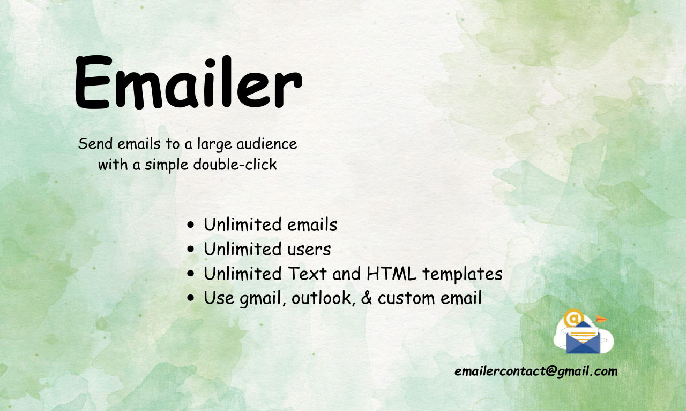

# Emailer

## Emailer - An Email automation software
Emailer is a meticulously crafted Python-based tool engineered to optimize email outreach and communication strategies. Its primary objective is to facilitate the efficient dissemination of emails to a broad audience, whether through established platforms like Gmail and Outlook or custom-tailored email services.
## Use Cases:
- Email marketing: Promote products, services, or events to a wide audience.
- Announcements: Share important news, updates, or announcements with employees or customers.
- Events: Send event invitations and reminders, and create newsletters to promote events and other content.
- Surveys: Gather valuable customer feedback and insights.
- Recruitment: Streamline the recruitment process by sending job offers, interview invitations, and application updates.
- Fundraising: Facilitate fundraising efforts by sharing campaign updates and engaging with donors.
## Highlighted Features: 
- Unlimited email sending.
- Supports both text and HTML templates.
- Personalized email template.
- Send email using Gmail or Outlook.
- Send email using company/organization email as well.
- Initial setup support and regular support are available.
## How to setup
Visit [here](https://docs.google.com/document/d/1PPFGif4xk3vEUmrO4osUGUqnr2n-NOcok9t70wTUTrk/edit) to get the full user guide step-by-step
## Demo:

## Contact
Feel free to contact us at emailercontact@gmail.com for any kind of support & queries.

